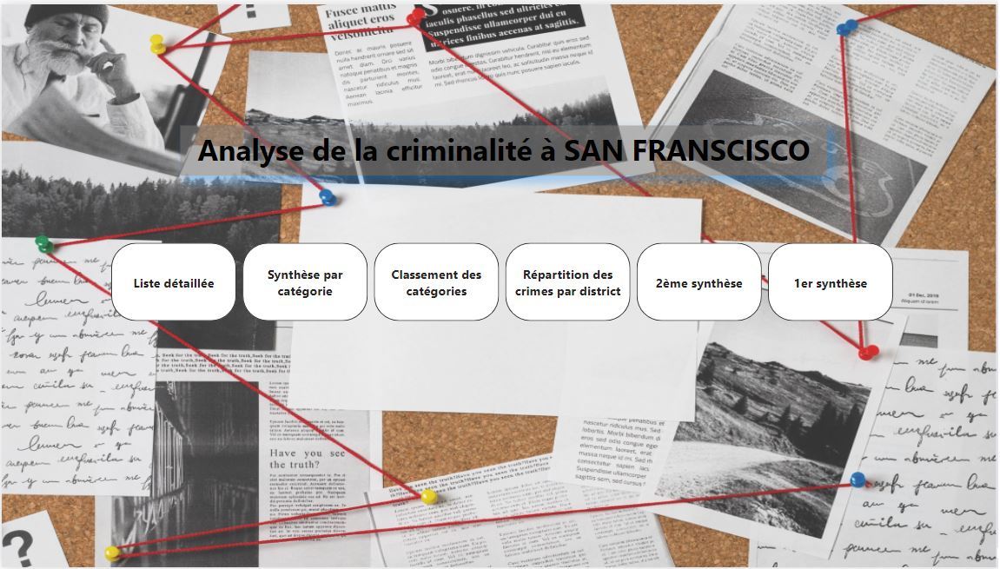
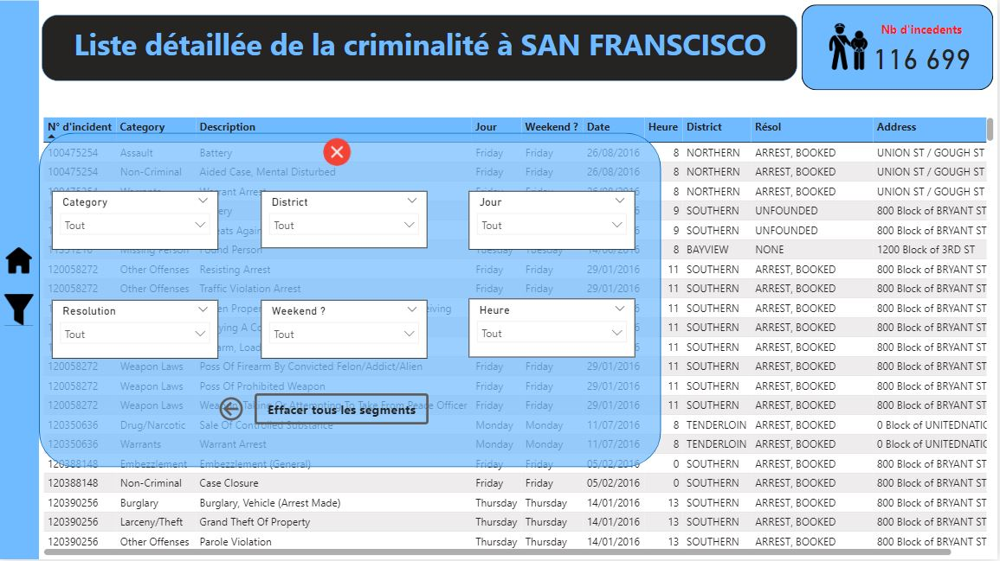
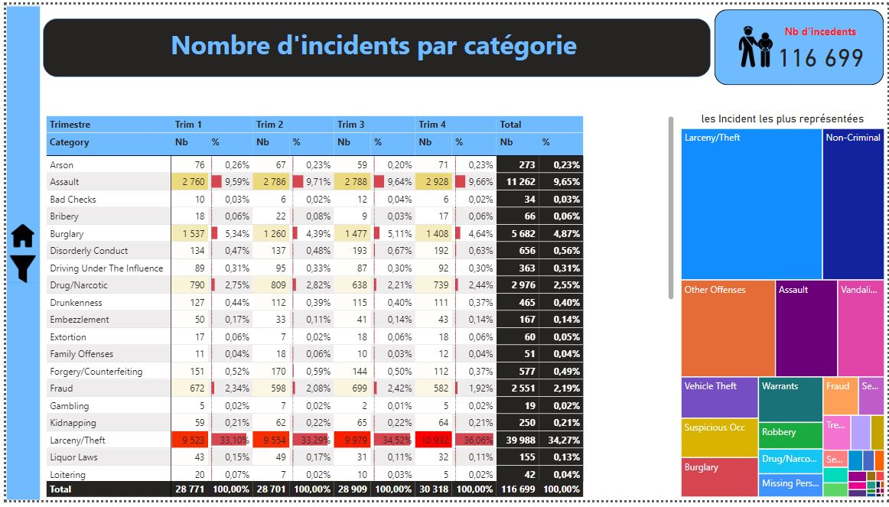
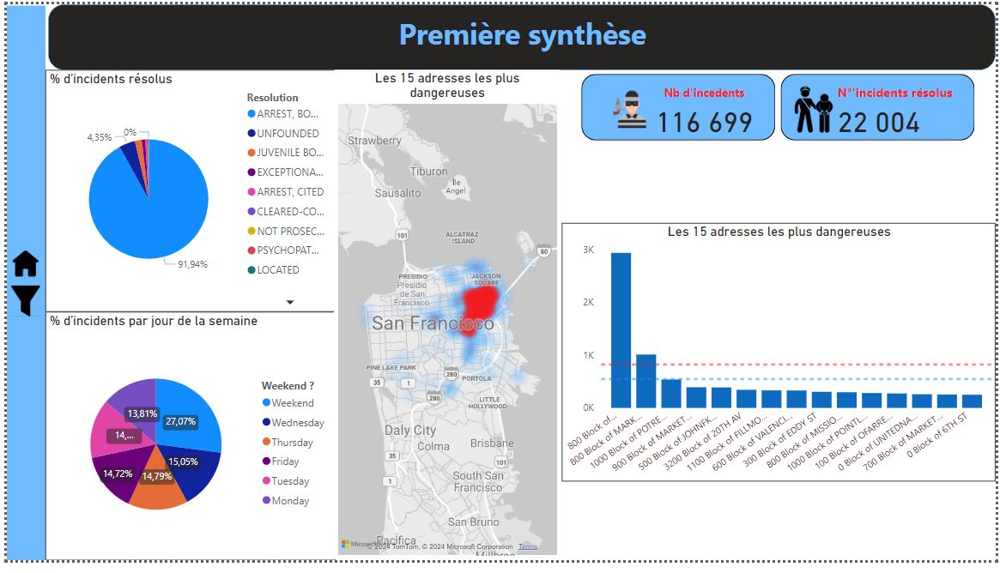

# Projet : Analyse de la Criminalité à San Francisco

## Catégorie
**Visualisation**

## Outils utilisés
**Power BI**

## Année
**2023/2024**

## Détail de projet

Ce projet de reporting sur la criminalité à San Francisco se concentre sur l'importation et la préparation des données à l'aide de Power Query, suivi de la mise en forme pour la visualisation dans Power BI. Les étapes comprennent l'importation du fichier CSV, l'exploration et la caractérisation des données, le renommage des champs, la création de mesures et de groupes de valeurs, ainsi que la personnalisation du rapport avec des filtres et des visualisations. Une fois le rapport finalisé, il est sauvegardé et publié sur Power BI pour une analyse interactive et une diffusion plus large.

## Capture d'ecran

### Home - Navigation de pages

### Liste détaillé avec Filtre 

### Répartition par catégories 

### Synthèse 

